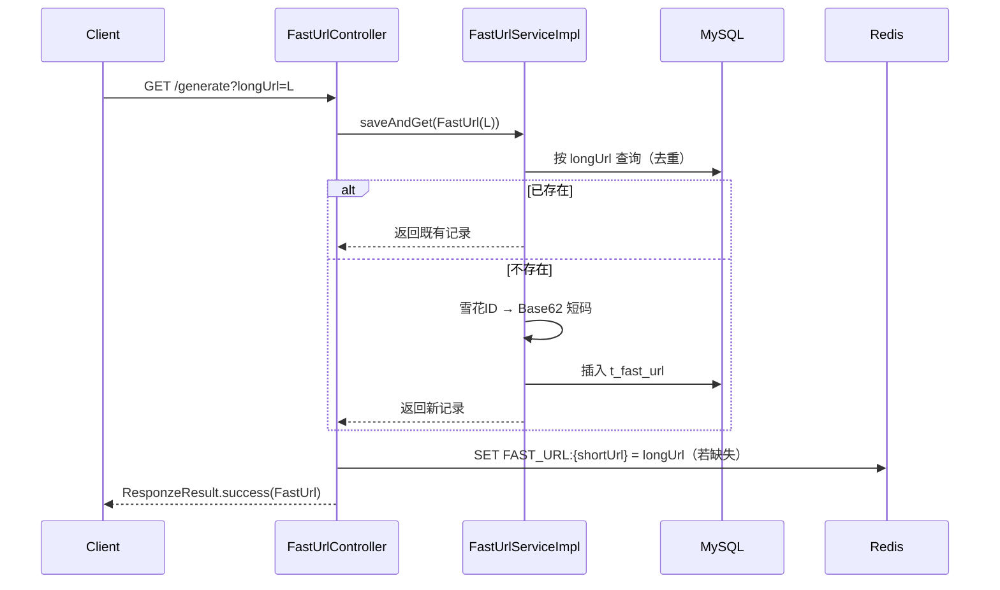
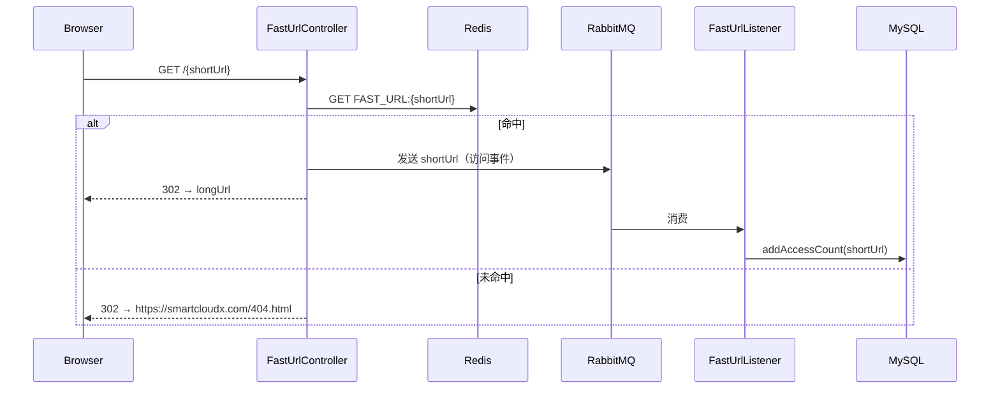

# 架构说明 / Architecture

本文档说明 `fast-url` 短链接服务的设计思路、核心组件与数据流，供二次开发与运维参考。

## 1. 设计目标 / Design Goals

- **短链生成**：把任意长网址压缩为可记忆的短码，且全局唯一、可重定向。
- **低延迟重定向**：通过 Redis 缓存短码 → 长链映射，避免每次重定向都查库。
- **异步统计**：访问计数与重定向主链路解耦，用 RabbitMQ 异步累加，不阻塞响应。
- **可靠消费**：RabbitMQ 手动 ACK，消费失败拒绝并重投，保证访问计数不丢。

## 2. 组件结构 / Components

```
cn.net.yunlou.fasturl
├── FastUrlApplication.java          # Spring Boot 启动类
├── controller/FastUrlController.java# 生成短链 / 重定向 / 发 MQ
├── service/
│   ├── FastUrlService.java          # 业务接口（saveAndGet）
│   ├── FastUrlServiceImpl.java       # 实现：去重 + 雪花ID + Base62
│   ├── FastUrlAccessService.java     # 访问计数接口（addAccessCount）
│   └── FastUrlAccessServiceImpl.java # 实现
├── mapper/
│   ├── FastUrlMapper.java            # t_fast_url
│   └── FastUrlAccessMapper.java      # t_fast_url_access
├── entity/
│   ├── FastUrl.java                  # 短链实体（@TableName t_fast_url）
│   └── FastUrlAccess.java            # 访问计数实体（含 MQ 常量）
├── listener/FastUrlListener.java     # RabbitMQ 消费：访问 +1（手动 ACK）
├── utils/
│   ├── Sequence.java                 # 雪花算法分布式 ID
│   ├── EncoderUtils.java             # Base62 编码（ID → 短码）
│   └── SystemClock.java              # 高并发时钟
└── ResponzeResult / ResponzeStatus / ResponzeException / IEnum  # 统一响应与异常
```

| 组件 | 职责 |
| --- | --- |
| `FastUrlController` | `GET/POST /generate?longUrl=` 生成短链（并写 Redis）；`GET /{shortUrl}` 重定向并发送访问事件到 MQ |
| `FastUrlServiceImpl` | 按长链去重；不存在则用雪花 ID + Base62 生成短码、落库 MySQL |
| `FastUrlListener` | 消费短链访问事件，调用 `FastUrlAccessService.addAccessCount` 累加，手动 ACK |
| `FastUrl` | 短链实体，`short_url` 即 Base62 短码，`CACHE_KEY_PREFIX = "FAST_URL:"` |
| `Sequence` / `EncoderUtils` | 分布式 ID 与短码编码 |

## 3. 生成与重定向流程 / Sequences

### 3.1 生成短链



### 3.2 重定向与访问统计



## 4. 短码设计 / Short-Code Design

- **ID 生成**：`Sequence`（雪花算法）生成 64 位分布式 ID，保证多实例下不冲突、趋势递增。
- **编码**：`EncoderUtils.encodeBase62(id)` 将长整型 ID 编码为 Base62 字符串（0-9A-Za-z），长度约 8–11 位，足够容纳极大短链空间。
- **去重**：`saveAndGet` 先按 `longUrl` 查询，同一长链只生成一个短码，重复请求返回既有记录。

## 5. 配置参考 / Configuration Reference

`src/main/resources/application.yml` 关键配置（均**需改为你自己的连接信息，切勿提交真实生产凭据**）：

| 配置项 | 说明 |
| --- | --- |
| `server.port` | HTTP 端口，默认 `8080` |
| `base.config.mysql.*` | MySQL 地址 / 端口 / 账号 / 密码，库名 `fast_url` |
| `base.config.redis.*` | Redis 地址 / 端口 / 密码 / database（默认库 1） |
| `base.config.rabbitmq.*` | RabbitMQ 地址 / 端口 / 账号 / 密码，virtual-host `/` |
| `spring.rabbitmq.listener.simple.acknowledge-mode` | `MANUAL`（手动 ACK） |
| `mybatis-plus.mapper-locations` | `classpath*:mapper/*Mapper.xml` |
| `server.undertow.*` | Undertow 线程 / buffer 调优（可选启用） |

> ⚠️ 当前文件内含真实服务器 IP 与密码（见 SECURITY.md），公开前请务必轮转并外部化。

## 6. 数据表 / Schema

- **`t_fast_url`**：`id`（雪花 ID）、`short_url`、`long_url`、`domain`、`create_time`、`update_time`、`del_flag` 等。
- **`t_fast_url_access`**：`id`（短码字符串）、`access_count` 等。

完整 DDL 见仓库根目录 `t_fast_url.sql` / `t_fast_url_access.sql`。

## 7. 部署形态 / Deployment

1. 准备 MySQL（建库 + 执行 DDL）、Redis、RabbitMQ；
2. 修改 `application.yml` 指向上述中间件；
3. `./mvnw clean package` → `java -jar target/fast-url.jar`；
4. 对外暴露建议前置 Nginx（HTTPS）并将短链域名解析到本服务。

## 8. 扩展建议 / Extensibility

- **配置外部化**：把 `base.config` 迁移到环境变量 / 配置中心，消除明文凭据。
- **缓存回源**：重定向缓存未命中时回查数据库，而非直接 404。
- **可配置域名**：短链域名、404 页改为配置项（当前硬编码）。
- **安全加固**：为 `/generate` 增加调用方鉴权、频控与防滥用。
- **统计可视化**：基于 `t_fast_url_access` 做访问报表。
